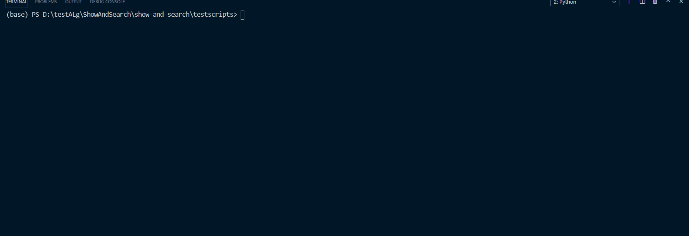

<!--
 * @lanhuage: python
 * @Descripttion: 
 * @version: beta
 * @Author: xiaoshuyui
 * @Date: 2020-09-15 13:51:52
 * @LastEditors: xiaoshuyui
 * @LastEditTime: 2020-09-18 09:59:24
-->
# show and search

## Inspired by [howdoi](https://github.com/gleitz/howdoi), I want to make a similar tool for python.

### if you are new to python or uncertain about modules and  functions,have a try.

# Two methods are supported now.

## [search!](./testscripts/testSearchIns.py)

 ## [show!](./testscripts/testShow.py)

 

 ## TODOs:

 1.complete build script [setup.py](./setup.py)
